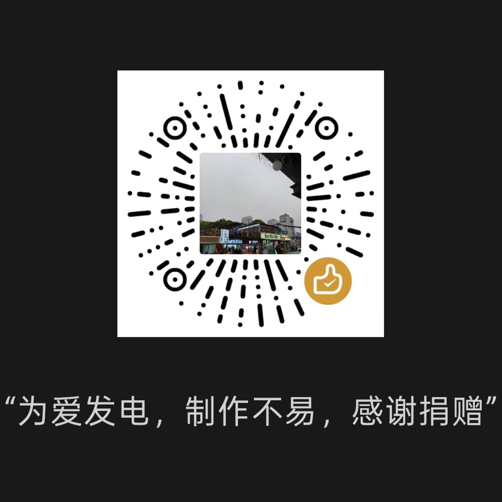

# Lynk APP Auto签到

> Lynk & Co App 能量体任务自动化工具 - 青龙面板 / 命令行通用版

每天自动签到 + 输出可点击的分享链接 + 多渠道推送（企业微信/钉钉/飞书/Telegram/Server酱/PushPlus/Bark）。

支持的能量体任务：
- 每日签到
- 签到任务进度查询（连续 7/30/85/365 天）
- 能量体余额 / 累计获得
- 成长等级 / 成长值
- 分享任务（生成 H5 链接，发微信后别人点击你 +5 能量体）
- 自动分享刷积分（需双账号）

---

## 目录

- [快速开始](#快速开始)
- [抓包教程（必读）](#抓包教程必读)
- [License 获取](#license-获取)
- [配置说明](#配置说明)
- [青龙部署](#青龙部署)
- [命令行直接跑](#命令行直接跑)
- [推送渠道](#推送渠道)
- [常见问题](#常见问题)
- [安全声明](#安全声明)

---

## 快速开始

### 1. 准备

- 一台能跑 Python 3.8+ 的机器（青龙面板 / NAS / Linux VPS / Mac 都行）
- 一个领克 APP 账号
- 抓包工具：Reqable / Charles / mitmproxy 任选

### 2. 安装依赖

```bash
pip install requests cryptography
```

> `cryptography` 用于 License RSA 签名验证，必须装。

### 3. 抓包（看下一节）

抓包后拿到两个值：
- `refreshToken`（28 天有效，登录响应里取）
- `device_id`（请求头里的 `gl_dev_id`）

脚本里面需要修改的地方 相同字段对应的值相同即可。

DEFAULT_SHARE_CONTENT_ID 分享文章的id

DEFAULT_DEVICE_ID 默认设备id

USER_DEVICE_ID 用户设备id 可与上面一样

USER_SHARE_CONTENT_ID 分享文章id

USER_REFRESH_TOKEN 用户的token

USER_DEVICE_ID  用户设备id


### 4. 跑脚本

```bash
# 第一步: 把脚本里的 token 改成你自己的
vim ql_lynk.py   # 改 USER_REFRESH_TOKEN 和 USER_DEVICE_ID

# 第二步: 申请 license
python3 ql_lynk.py --request-license
# 把输出的 request_code 发给作者 (附捐赠截图)

# 第三步: 拿到 license.txt 后, 放到脚本同目录
# 然后跑:
python3 ql_lynk.py
```

---

## 抓包教程（必读）

### 工具准备

- **iOS 用户**：Reabble / Charles / Stream（免费）+ iPhone 安装 CA 证书
- **Android 用户**：Reqable / Charles / HttpCanary
- 推荐：**Reqable**（中文，免费，跨平台）

### 抓包流程

#### 步骤 1：开抓包，登录领克 APP

```
1. 打开抓包工具 → 启动录制 (HTTPS)
2. 打开领克 APP → 我的 → 退出登录 (如果已登录)
3. 重新登录: 输入手机号 + 验证码
4. 登录成功进入首页
5. 停止抓包
```

> ⚠ **必须在登录之前就开抓包**，因为 refreshToken 只在登录响应里返回一次。

#### 步骤 2：找到 refreshToken

在抓包记录里搜索 `mobileCodeLogin` 或 `auth-code`，找到登录请求。

**完整请求示例**：

```http
POST https://app-services.lynkco.com.cn/auth/login/mobileCodeLogin?deviceId=
```

**响应体 (JSON)**：

```json
{
  "code": "success",
  "data": {
    "centerTokenDto": {
      "token": "bearer<accessToken>",     ← 这是 accessToken (10分钟有效, 不要用!)
      "cepToken": "...",
      "svcToken": "...",
      "refreshToken": "bearer<refreshToken>",  ← ★★★ 这个就是 ★★★
      "refreshExpireAt": 1780000000000,  // 占位
      "expireAt": 1780000000000
    },
    ...
  }
}
```

**需要拷贝的值**：

```
data.centerTokenDto.refreshToken 字段值
例如: bearer<UUID>  (格式: bearer + 36 位 UUID)
```

> ⚠ **注意区分**：
> - `token` 字段是 accessToken（10 分钟有效）
> - `refreshToken` 字段才是我们需要的（28 天有效）
> - 两个长得一模一样，只是名字不同

#### 步骤 3：找到 device_id

在抓包记录里随便找一个 `app-services.lynkco.com.cn` 或 `app-api-gw-toc.lynkco.com` 域名的请求，看请求头：

```http
gl_dev_id: <你的 gl_dev_id, 抓到的
```

或者从登录 URL 的 query 参数 `deviceId` 里拿：

```
deviceId=<你的 deviceId, 不带横线的 UUID 或带横线都可>
```

> 实际上登录 URL 里的 `deviceId` 和请求头里的 `gl_dev_id` 是两个不同的 ID：
> - `deviceId`（去掉横线或保留都可以）：用于 refresh 接口
> - `gl_dev_id`：APP 设备 ID，用于业务请求头
>
> 脚本里默认用的是 `USER_DEVICE_ID`（带横线的 UUID），一般从登录 URL 的 `deviceId` 参数里拿。

#### 步骤 4：填到脚本里

编辑 `ql_lynk.py` 第 85-87 行：

```python
USER_REFRESH_TOKEN = "bearer你抓到的refreshToken"     # 28 天有效
USER_DEVICE_ID     = "0846611111111111111111111111111"  # 从登录URL拿
```

---

## License 获取

> ⚠ 本项目采用 **RSA 离线签名 license**，作者无需维护服务器，验证在客户端完成。
> 设备绑定防扩散，license 复制到别人机器用不了。

### 流程

```
用户                              作者
 │                                │
 ├─ 1. 跑 --request-license       │
 │     输出 request_code          │
 │   ───────────────────────→     │
 │                                ├─ 2. gen_license.py 签发
 │                                │     输出 license.txt
 │   ←───────────────────────     │
 ├─ 3. 收到 license.txt            │
 │     放到脚本同目录               │
 │                                │
 ├─ 4. 跑脚本                      │
 │     自动验证 RSA 签名            │
 │     通过 → 正常签到              │
 └─                                ┘
```

### 步骤 1：申请 license

```bash
python3 ql_lynk.py --request-license --request-note "微信号:xxx"
```

输出：

```
============================================================
📨 request_code (把下面这一整段发给作者)
============================================================
eyJkZXZpY2VfaGFzaCI6IjIwYjMyODJiNThhNjQ3OWU1M2YwMTkyNzIw...
============================================================

附带信息 (仅参考):
  本机 fingerprint: 20b3282b58a6479e53f01927...
  hostname:          MacBook-Pro
  platform:          macOS-27.0-arm64-arm-64bit
  note:              微信号:test123
```

把那一长串 `eyJ...` 发给作者 + 捐赠截图。

### 步骤 2：收到 license.txt

捐赠后联系作者，作者将`license.txt` 发回。

把 `license.txt` 放到脚本同目录，或者：
- `/ql/data/lynk_license.txt`（青龙数据目录）
- `~/.lynk_license.txt`（用户 home）

### 步骤 3：验证

```bash
python3 ql_lynk.py
# 输出: [OK] license 有效: user=wechat:xxx  剩 29 天  note=xxx
```

### License 失效场景

| 触发 | 错误提示 |
|---|---|
| 没 license.txt | `⚠ 未找到 license.txt, 本脚本需要授权后才能运行` |
| license 已过期 | `X license 已过期 (到期 2026-08-07 20:07)` |
| license 复制到别的机器 | `X license 与当前设备不匹配` |
| license 被篡改 | `X license 签名验证失败: InvalidSignature` |
| 缺少 cryptography | `X 缺少 cryptography 库, 请先装: pip install cryptography` |

---

## 配置说明

脚本顶部 `USER_CONFIG` 块（优先级最低，最高是命令行参数）：

```python
USER_REFRESH_TOKEN     = "bearer..."   # 主账号 refreshToken
USER_DEVICE_ID         = "..."         # 设备 ID
USER_AUTO_SHARE        = False         # 自动分享 (需要 USER_TOKEN_B)
USER_TOKEN_B           = ""            # B 账号 refreshToken (逗号分隔多个)
USER_SHARE_CONTENT_ID  = "2072260486405246976"   # 分享文章 ID
USER_PUSH_WECOM_WEBHOOK = ""           # 企业微信 webhook (留空不推送)
```

**优先级**：

```
命令行参数 > 环境变量 (LYNK_*) > 脚本顶部 USER_CONFIG
```

**常用环境变量**（替代脚本改值）：

```bash
export LYNK_REFRESH_TOKEN="bearer你的token"
export LYNK_DEVICE_ID="0846611111111111111111111111111"
export LYNK_AUTO_SHARE=1
export LYNK_TOKEN_B="bearerB账号token"
export LYNK_SHARE_CONTENT_ID="2072260486405246976"
export PUSH_WECOM_WEBHOOK="https://qyapi.weixin.qq.com/cgi-bin/webhook/send?key=xxx" 微信的bot key 
```

---

## 青龙部署

### 步骤 1：上传脚本

青龙面板 → 脚本管理 → 上传 `ql_lynk.py`

或 SSH 到容器：

```bash
scp ql_lynk.py root@青龙IP:/ql/scripts/
```

### 步骤 2：安装依赖

青龙容器内（终端）：

```bash
docker exec -it ql bash
pip install requests cryptography
# 如果青龙面板装了 python3 requests 但没 cryptography
```

### 步骤 3：申请 license

在青龙容器内跑：

```bash
cd /ql/scripts
python3 ql_lynk.py --request-license --request-note "青龙的微信号"
```

把 `request_code` 发给作者换 `license.txt`，放到 `/ql/data/lynk_license.txt` 或脚本同目录。

### 步骤 4：配置环境变量（可选）

青龙面板 → 环境变量 → 添加：

```
名称: LYNK_REFRESH_TOKEN
值:   bearer你的refreshToken

名称: PUSH_WECOM_WEBHOOK
值:   https://qyapi.weixin.qq.com/cgi-bin/webhook/send?key=xxx
```

### 步骤 5：定时任务

青龙面板 → 定时任务 → 添加：

```
名称:    lynk_签到
命令:    ql_lynk.py
定时规则: 0 9 * * *      ← 每天 9 点
```

> ⏰ **建议 9:00**，避开 0:00 整点风控高峰。

---

## 命令行直接跑

```bash
# 最简: 用脚本顶部默认配置
python3 ql_lynk.py

# 指定 token
python3 ql_lynk.py --token "bearer你的refreshToken"

# 仅查状态不签到
python3 ql_lynk.py --status

# 强制 refresh (忽略 8 分钟缓存)
python3 ql_lynk.py --no-cache

# 清空 accessToken 缓存
python3 ql_lynk.py --clear-cache

# 自动分享 (A 创建 shareCode, B 点击)
python3 ql_lynk.py \
  --token-a "bearerA" \
  --token-b "bearerB" \
  --content-id "2072260486405246976" \
  --auto-share

# 申请 license
python3 ql_lynk.py --request-license --request-note "微信号:xxx"
```

---

## 推送渠道

支持 7 种渠道，配置对应的环境变量即可（多个可同时启用）：

| 渠道 | 环境变量 | 获取方式 |
|---|---|---|
| 企业微信 | `PUSH_WECOM_WEBHOOK` | 群 → 添加机器人 → 复制 webhook |
| 钉钉 | `PUSH_DINGTALK_WEBHOOK` | 群 → 智能群助手 → 添加机器人 |
| 飞书 | `PUSH_FEISHU_WEBHOOK` | 群 → 设置 → 群机器人 |
| Server酱 | `PUSH_SERVERCHAN_KEY` | [sct.ftqq.com](https://sct.ftqq.com) 登录拿 SendKey |
| PushPlus | `PUSH_PUSHPLUS_TOKEN` | [pushplus.plus](https://pushplus.plus) 拿 token |
| Bark | `PUSH_BARK_URL` | iOS Bark app 自部署 |
| Telegram | `PUSH_TG_BOT_TOKEN` + `PUSH_TG_CHAT_ID` | [@BotFather](https://t.me/BotFather) 创建 bot |

**示例：企业微信推送输出**：

```
# 领克签到成功
时间:        2026-07-08 09:00:15
accessToken: 缓存命中
签到:        ✅ 签到成功
连续:        51 天  /  补签卡: 0 张

账户信息:
- 积分余额: 1885  /  累计获得: 5098
- 成长等级:   二级  /  成长值: 1680

签到任务进度:
- 连续签到7天:    3 / 7   (1能量体)
- 本月度签到25天: 6 / 25  (1补签卡)
- 本季度签到85天: 6 / 85  (2补签卡)
- 连续签到365天:  51 / 365 (20能量体, 365Co积分)

📤 分享链接 (复制到微信发, 别人点击你 +5 能量体):
[👉 点击领取 +5 能量体](https://h5.lynkco.com/...)

📋 原始链接 (复制用): https://h5.lynkco.com/...
```

> 链接格式：标准 markdown `[text](url)` (PC 端蓝色可点击) + 末尾 raw URL (移动端长按复制)。

---

## 常见问题

### Q: refreshToken 多久过期？需要重抓吗？

A: 28 天。脚本每次跑时会自动用 refreshToken 换新的 refreshToken，**只要脚本一直跑就不用重抓**。如果停了 28+ 天没跑，需要重新抓包。

### Q: accessToken 和 refreshToken 长得一模一样，怎么区分？

A: 都以 `bearer<UUID>` 开头，区分方法是看生命周期：
- **accessToken**：10 分钟有效。每次 APP 启动 / 后台切前台时由 refreshToken 换发
- **refreshToken**：28 天有效。登录响应一次性返回

> ⚠ **不要把 accessToken 当 refreshToken 用** —— UAA 会标记失效，错误 `user_refresh_invalid_expired`。重新抓包。

### Q: 为什么必须开抓包登录一次才能拿到？

A: refreshToken 是登录响应里一次性返回的，APP 不会在普通 API 请求中暴露它。退出登录后再登录，会重新返回。

### Q: License 复制给朋友能用吗？

A: 不能。每个 license 绑定到首次运行时的机器指纹（`/etc/machine-id` + MAC + hostname hash），换机器直接报 `license 与当前设备不匹配`。

### Q: 青龙容器每次重启 fingerprint 会变吗？

A: 不会。青龙容器 `/etc/machine-id` 在容器生命周期内稳定。除非删容器重建，否则 fingerprint 不变。

### Q: License 过期了怎么办？

A: 重新跑 `--request-license` 生成新 request_code，发作者再签一次。

### Q: 想换机器怎么办？

A: 旧 license 在新机器上会失败。在新机器跑 `--request-license`，把新 request_code 发作者，作者签新 license。

### Q: 推送链接点不动？

A: PC 端企业微信能识别 markdown 链接 `[text](url)` 为蓝色可点击。手机端部分版本不渲染，建议长按末尾「📋 原始链接」那行直接复制。

### Q: 自动分享需要几个账号？

A: 至少 2 个。一个主账号 A 创建 shareCode，一个 B 账号点击 H5 链接。B 账号点击后 A 账号获得 5 能量体/人/天。

---

## 安全声明

- 本工具仅供个人学习与技术研究使用
- 请勿用于任何商业用途或大规模自动化
- 请遵守领克 APP 用户协议，不要频繁请求接口
- 作者不对使用本工具造成的任何后果负责
- 抓包获取的 token 请妥善保管，不要外泄

---

## License

本项目代码采用 MIT 协议开源，但**运行本项目需要单独的授权 license**（见 [License 获取](#license-获取)）。

- 代码：MIT License
- 运行授权：联系作者获取 (捐赠后发放)


个人研究不易，还望各位切勿倒卖


---

## ☕ 请作者喝杯咖啡

如果这个工具帮到了你，可以请作者喝杯咖啡 ☕

你的支持是这个项目持续维护的动力。

| 微信赞赏 | 备注 |
|:---:|:---|
|  | 赞赏后请加作者微信 (见 license.txt 里的 user 字段), 发送截图领取 license |
|  | 扫码联系作者 |

**捐赠后获取 license**：

1. 扫码捐赠任意金额 (越多维护越勤快)
2. 截图发作者 + 你的 `request_code` (`python3 ql_lynk.py --request-license` 输出)
3. 作者会回你 `license.txt`
4. 放到脚本同目录即可

**为什么不免费**：

- 防止脚本被无限复制分发，作者有时间持续维护更新

- 防止刷号 / 恶意使用，导致领克官方升级接口风控伤害普通用户

  尊重别人劳动成果，谢谢！ 

  
